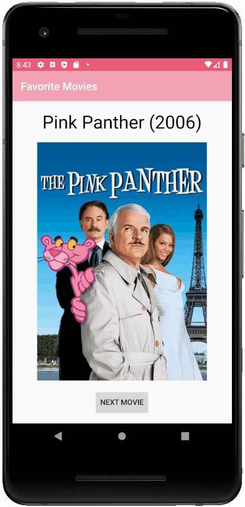

# Android Weekly Series

Welcome to the Android Weekly Series!
Here we will cover all the essential skills needed to build professional, robust, and attractive Android apps.

## 4. Favourite Movies App

Cycle through your favourite movies!

This sample app only shows Pink Panther and Pink Panther 2 (my favorite movies!), but you can change this to your liking!

### Screenshots
 

 
 

### Skills Learned

* Android layout
  * More complex ConstraintLayout
  * TextView, ImageView, Button
  * Intro to Material Design
* Android coding
  * OnClickListeners
  * findViewById() to programmatically modify views in XML
